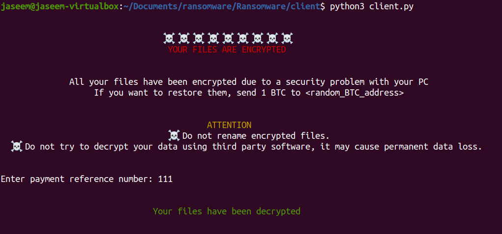

<div align="center">
    
</div>

## About The Project

This is a ransomware program consisting of a client and a server made as part of the course project for Computer Security (CS4035D) course

## Usage

1. Clone the repo
   ```sh
   git clone https://github.com/sachint2001/Ransomware.git
   ```
2. Generate RSA keys for the server
   ```sh
   python3 server/generateKey.py
   ```
3. Run the WSGI server
   ```sh
   python3 server/server.py
   ```
4. Run the client malware program
   ```sh
   python3 client/client.py
   ```
   To decrypt the files, enter `111` as the payment reference number
